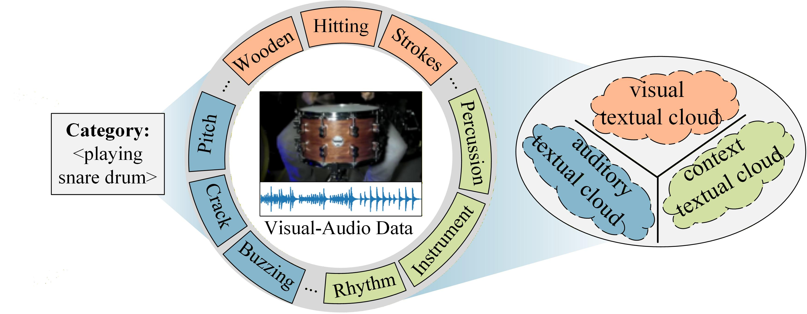

# Sight, Sound, and Sense: Unfolding Textual Clouds for Audio-Visual Generalized Zero-Shot Learning

This repository is the official implementation.
<p align="center">
  
</p>

## Requirements
We recommend using **Conda** to manage your environment:
```bash
conda env create -f environment.yml
conda activate zero
```

## Step 1: Obtaining Datasets
### 1.Download GZSL benchmark datasets: VGGSound-GZSL, ActivityNet-GZSL, and UCF-GZSL
Encoded by Cip&Clap: [ Cip&Clap](https://github.com/dkurzend/ClipClap-GZSL)  

Encoded by C3D&VGGish  and SeLavi : [AVCA](https://github.com/ExplainableML/AVCA-GZSL)

Please place the downloaded data into the `./data/` directory. 
Meanwhile, remember to update the corresponding data paths 
in `dataset_all/VGGSound_ZSL.py`, `dataset_all/ActivityNet_ZSL.py`, `dataset_all/UCF_ZSL.py`to match your local environment.

### 2.Download Textual Cloud ☁️
We provide the pre-processed textual cloud data. You can choose to download it directly or generate it from scratch.

#### Option 1: Direct Download

You can download the pre-extracted features from [textual_cloud](https://drive.google.com/file/d/1PMt8EuDySrSMdrlDO4C8pCbPTdTa-LaF/view?usp=drive_link) and place the unzipped file in the `./data/` directory.

#### Option 2: Generate from Scratch

If you want to generate the textual clouds manually, please follow these steps:

1. Run the following script to generate 500 semantic descriptions using Llama (Llama download in [here](https://huggingface.co/meta-llama/Llama-3.1-8B-Instruct)):
   ```bash
   python get_textual_cloud_llama.py
   ```
2. Extract Top-K clouds: Run the following script to 
filter and obtain the top-50 most representative textual clouds:
   ```bash
   python get_topk_textual_cloud.py
   ```
(Visual Encoder: The weights  will be automatically downloaded via `clip.load("ViT-B/32")`.
Audio Encoder: Please download the pre-trained audio checkpoint manually from the [WavCaps](https://github.com/XinhaoMei/WavCaps)):

Please place the textual_cloud into the `./data/` directory. Meanwhile, remember to update the corresponding data paths in 
`dataset_all/VGGSound_ZSL.py`, `dataset_all/ActivityNet_ZSL.py`, `dataset_all/UCF_ZSL.py` to match your local environment.
## Step 2: Training

### Option 1. Quick Start
To train the model on the VGGSound-GZSL dataset, you can simply run the provided shell script:
```bash
bash run_VGGSound.sh
```
(Note: You can similarly run scripts for other datasets like `run_ActivityNet.sh` or `run_UCF.sh`)

### Option 2. Manual Training
You can execute `main.py` with custom arguments on VGGSound-GZSL:
```bash
python main.py \
    --dataset_name VGGSound \
    --data_dir "" \
    --run all \
    --exp_name training \
    --modality both  \
    --lr 0.0001 \
    --epochs 10 \
    --batch_size 64 \
    --n_batches 300 \
    --AV_coefficien 1.0 \
    --context_coefficien 1.0 \
    --hidden_size 512 \
    --dropout 0.3 
```
On ActivityNet-GZSL:
```bash
python main.py \
    --dataset_name ActivityNet \
    --data_dir "" \
    --run all \
    --exp_name training \
    --modality both  \
    --lr 0.0001 \
    --epochs 10 \
    --batch_size 64 \
    --n_batches 300 \
    --AV_coefficien 1.0 \
    --context_coefficien 1.0 \
    --hidden_size -1 \
    --dropout 0.1 
```
On UCF-GZSL:
```bash
python main.py \
    --dataset_name UCF \
    --data_dir "" \
    --run all \
    --exp_name training \
    --modality both  \
    --lr 0.00007 \
    --epochs 18 \
    --batch_size 64 \
    --n_batches 300 \
    --AV_coefficien 1.0 \
    --context_coefficien 1.0 \
    --hidden_size -1 \
    --dropout 0.1 
```
```
arguments:
--data_dir DATA_DIR indicates the location where the dataset is stored.
--dataset_name {VGGSound, UCF, ActivityNet} indicate the name of the dataset.
--run {'all', 'stage-1', 'stage-2'}. 'all' indicates to run both training stages + evaluation, whereas 'stage-1', 'stage-2' indicates to run only those particular training stages
```


## Step 3: Evaluation

We provide two ways to evaluate the model's performance: **Automatic Evaluation** during training and **Manual Evaluation** using pre-trained weights.
### 1. Automatic Evaluation
If you want the model to automatically evaluate its performance on the test set during the training process, simply set the `--run` argument to `all`.
### 2.Manual Evaluation
For manual evaluation run the following command:
```
python get_evaluation.py \
    --load_path_stage_A  "" \
    --load_path_stage_B "" \
    --dataset_name VGGSound \
    --data_dir "" \
    --exp_name eval \
```
```
arguments:
--load_path_stage_A will indicate to the path that contains the network for stage 1
--load_path_stage_B will indicate to the path that contains the network for stage 2
--dataset_name {VGGSound, UCF, ActivityNet} will indicate the name of the dataset
--data_dir points to the location where the dataset is stored
```

## Model Weights

Our fully trained model weights are available for download [here](https://drive.google.com/file/d/1jcgnBVD09qgPBzxhpw9-Jd0-Zf2ZyYLL/view?usp=drive_link). 

When loading these pre-trained weights for evaluation or inference, please ensure that your runtime arguments and dataset configurations match those saved in the `.pkl` file. 

## Project Structure

```text
├── config/              # Configuration parameters and settings
├── dataset_all/         # Dataset loading and data processing scripts
├── eval/                # Evaluation functions and metrics
├── model/               # Network architectures and model definitions
├── src/                 # Utilities and parameter/argument definitions
├── train/               # Training pipelines and loops
├── main.py              # Main entry point for training and evaluation
└── run_xxx.sh           # Bash script to easily reproduce xxx dataset results
```


